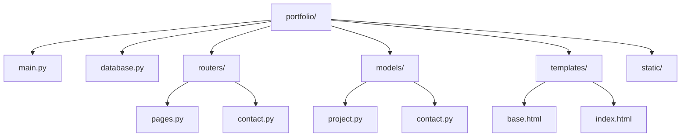

# Portfolio 
This is a portfolio of my work as a software developer. It includes projects that I have worked on, as well as my resume and contact information.

## Tech Stack
- Python
- SQLAlchemy
- FastAPI
- Jinja2
- SQLite
- Bootstrap

## Features 
- About Me section/ Resume (downloadable)
- Projects section (with links to GitHub repositories)
- Contact section (with a contact form)
- Responsive design (works on mobile and desktop)
- Contact info stored in a SQLite database

## Project Structure

## Running Locally
1. Clone the repository
2. Create a virtual environment and activate it
3. Install the dependencies: `pip install -r requirements.txt`
4. Run the application: `uvicorn main:app --reload`
5. Open your browser and navigate to `http://localhost:8000`

## Status 
This project is currently in development.